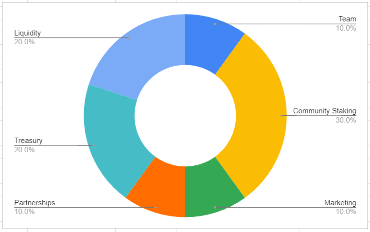

# 4.2. Economics

Behind the platform, lies an economy engine used to determine the price of $GRYPH relative to the blockchain it lives in (the “Engine”). To make this less confusing, ETH will be used to explain the examples within this section. GRYPH uses this Engine similar to how paid-in capital is used to determine the value of corporate shares.

.png>)

> **NOTE:** If GRYPH initially deposited 1,000 ETH as “paid-in”, then to calculate the value per token is simply 1,000 ETH / MAX SUPPLY.

When capital is sent to the Engine, it prices $GRYPH value by what it is willing to buy tokens for and sell tokens for automatically. If more capital is added, the prices would rise and if capital was removed then the price would fall. The example dataset below models how $GRYPH would be priced at any given time and how the Engine gains capital over time.

.png>)

Since $GRYPH is backed by assets in the Engine (the “Treasury”), it inherently kind of controls what the suggested price should be while allowing room for speculative trading. It would not make any sense for a seller to list $GRYPH below what the Engine is willing to buy it for and likewise above what it is willing to sell it for. At the same time, the suggested price thresholds by no means are reasonably priced. This means both buyers and sellers will always have an advantage over the engine as long as the exchanges are happening between the thresholds.

In the example above, if a holder makes a sell order for 0.3 ETH, a buyer would see that’s a good deal compared to the Engine’s sell order for 0.5 ETH. Likewise, when a holder makes a buy order of 0.3 ETH, a seller should see that’s also a good deal compared to the Engine’s buy order of 0.1 ETH.

In an extreme case, if everyone lists their tokens under the buy back price, the Engine would just buy every token, leaving everyone else with no other option than to buy it for the Engine’s selling price. Oppositely if all $GRYPH were distributed out, then the Engine would just wait for someone to sell it for the Engine’s buy back price.

The platform uses this Engine to determine what the listing and transaction fees should be. Whenever an NFT is sold, the platform fees are sent to this Engine in exchange for tokens to be awarded to both the buyer and seller. If $GRYPH was used to offset the fees, then $GRYPH is sent to the Engine in exchange for the native cryptocurrency. Based on this logic the Engine can calculate the rewards and fees in gryph with the following formulas.

> **GRYPH FEES** = (ETH CAPITAL / MAX SUPPLY \* 200%) \* (NFT ETH LISTING \* 2%)\
> **GRYPH REWARDS** = (ETH CAPITAL / MAX SUPPLY \* 50%) \* (NFT ETH LISTING \* 2%)

Overall $GRYPH is also used as gas fees for the marketplace. With that said, GRYPH is planning to eventually cap the price if it ever reaches above two dollars ($2) in order to keep these gas fees reasonably priced.
